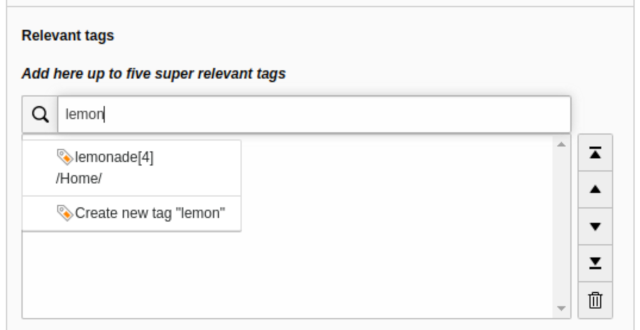

# TYPO3 Extension t3tags

[](https://packagist.org/packages/ichhabrecht/t3tags)
[](https://travis-ci.org/IchHabRecht/t3tags)
[](https://styleci.io/repos/174751542)

Add custom tag fields to every TYPO3 record type.



## Features

- Allows integrators to add one or many tag fields to any record type
- New tags can be added on the fly and are created only when the record is saved
- Existing tags are show in a autocomplete wizard
- New tags that are added to multiple tag fields are created only once in database
- Integrates into Core API and extends `group` field behaviour

## Installation

1. Install the extension with Composer or the [Extension Manager](https://extensions.typo3.org/extension/t3tags/).

`composer require ichhabrecht/t3tags`

2. In the extension settings configure a page uid, where tags should be stored.

## Configuration

“Tag” fields may be added to any table. In the following example we add two
tag fields to »tt_content« records.

- Add or extend the `ext_tables.sql` file in your sitepackage extension
  to add the new tag fields to the database table

```
CREATE TABLE tt_content
(
    relevant_tags int(11) DEFAULT '0' NOT NULL,
    content_tags int(11) DEFAULT '0' NOT NULL
);
```

- Add or extend a TCA override file in your sitepackage extension,
  in this case `Configuration/TCA/Overrides/tt_content.php`

```
<?php
defined('TYPO3_MODE') || die();

(function () {
    $tagRegistry = \TYPO3\CMS\Core\Utility\GeneralUtility::makeInstance(\IchHabRecht\T3tags\Configuration\TagRegistry::class);

    $tagRegistry->makeTaggable(
        'tt_content',
        'relevant_tags',
        [
            'label' => 'Relevant tags',
            'position' => 'after:--palette--;;access',
            'fieldConfiguration' => [
                'maxitems' => 5,
                'fieldInformation' => [
                    'tagInformation' => [
                        'options' => [
                            'labels' => [
                                0 => [
                                    'label' => 'Add here up to five super relevant tags',
                                ],
                            ],
                        ],
                    ],
                ],
            ],
        ]
    );

    $tagRegistry->makeTaggable(
        'tt_content',
        'content_tags',
        [
            'label' => 'Content tags',
            'position' => 'after:relevant_tags',
            'fieldConfiguration' => [
                'fieldInformation' => [
                    'tagInformation' => [
                        'options' => [
                            'labels' => [
                                0 => [
                                    'label' => 'Add here unlimited content tags that describe your topic and the content detail',
                                ],
                            ],
                        ],
                    ],
                ],
            ],
        ]
    );
})();
```

*Parameters*

1. Table name: Existing TCA table that should be extended
2. Field name: Name of the new tag field that should be added
3. Options: Additional field configuration, according to TCA field configuration
    - label
    - exclude
    - fieldConfiguration (config)
    - l10n_display
    - l10n_mode
    - displayCond
    - position
    - interface
    - fieldList
    - typesList
4. override: True, if any existing field configuration should be replaced with the one provided

## Usage

**Get all tags for a record by field**

```
$tagRepository = \TYPO3\CMS\Core\Utility\GeneralUtility::makeInstance(\IchHabRecht\T3tags\Domain\Repository\TagRepository::class);
$tagRepository->findTagsByField('tt_content', 'relevant_tags', 42);
```

- Returns all tags (as array) from a `tt_content` element with uid `42` and its field `relevant_tags`

**Get all tags by record**

```
$tagRepository = \TYPO3\CMS\Core\Utility\GeneralUtility::makeInstance(\IchHabRecht\T3tags\Domain\Repository\TagRepository::class);
$tagRepository->findTagsByRecord('tt_content', 42);
```

- Returns all tags (as array) from a `tt_content` element with uid `42`. According to the example registration from above, tags from `relevant_tags` and `content_tags` are returned.
